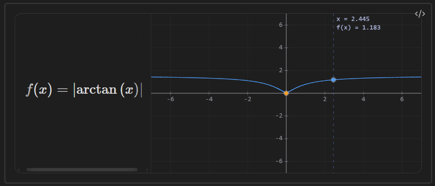
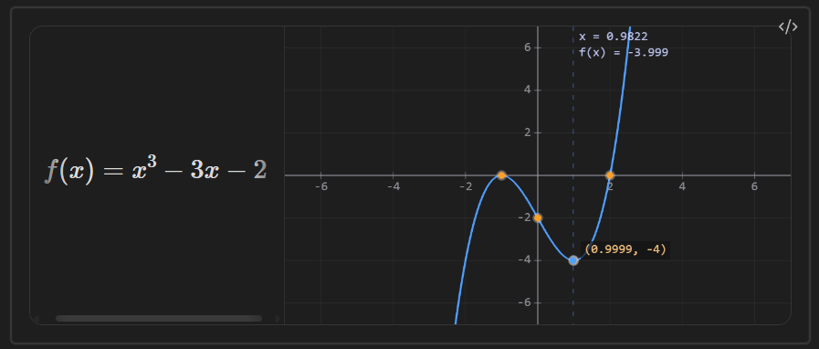
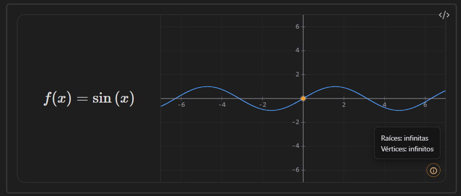
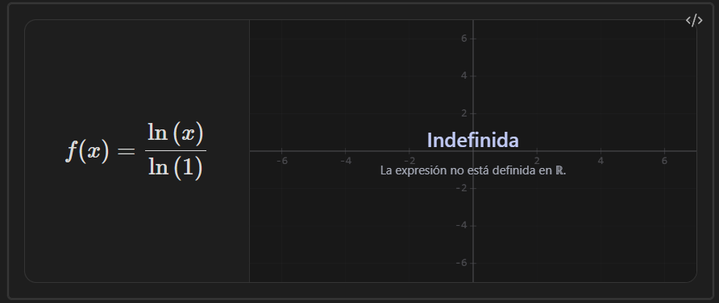
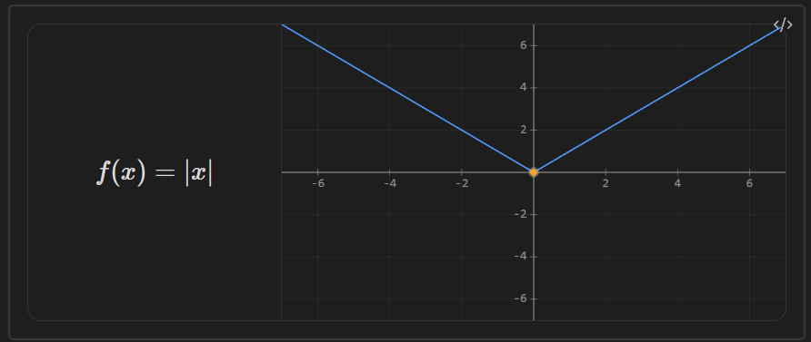
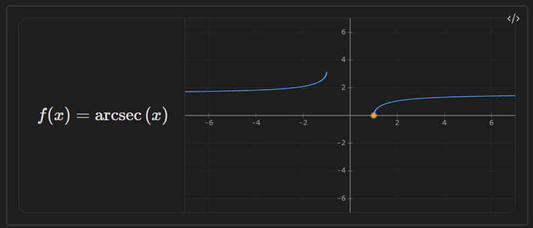

# obsi-math

🇪🇸 [Español](./README.es.md) · 🇬🇧 [English](./README.en.md)

An Obsidian plugin for graphing mathematical functions directly inside your notes using `obs-graph` code blocks. It renders the expression in LaTeX, draws the graph using a WebGL + Canvas 2D engine (Desmos-style), and automatically computes roots, vertices, and the Y-intercept.


---

## Features

* 📈 Real-time graphing with a WebGL engine (curves) + Canvas 2D (axes, grid, labels).
* ✏️ LaTeX rendering of the entered expression, including nested exponents and roots of any degree.
* 🔍 Interactive zoom and pan with the mouse.
* 🖱️ Interactive crosshair: follows the cursor and displays `x` and `f(x)` in real time, with a marker on the curve.
* 📍 Automatic detection of roots, vertices (maxima/minima), and the Y-intercept (`f(0)`), displayed as orange markers on the graph. Hovering near a notable point shows its coordinate label.
* ⚡ Vertical asymptotes automatically detected and drawn as dashed lines, including cases where both branches diverge in the same direction (`1/x²`, `x⁻⁴`, etc.).
* ⚠️ Classification of non-graphable functions in ℝ (*Undefined in ℝ*, *Undefined*, *Indeterminate*), with an informational overlay and an interactive graph plane.
* 🎨 Subtle grid, clean axes, proper margins and centering, with no distortion when resizing.
* 🔤 Input support for LaTeX, Unicode (`π`, `√`, `×`, `÷`, `²`, `³`), and standard mathematical notation.
* 📐 Support for absolute value (`|x|`, `\left|…\right|`, `abs(x)`) and all six inverse trigonometric functions (`arcsin`, `arccos`, `arctan`, `arccsc`, `arcsec`, `arccot`) in multiple input formats.






---

## Installation

### Manual

1. Download `main.js`, `manifest.json`, and `styles.css` from the latest release.
2. Create the `obsi-math` folder inside `<your-vault>/.obsidian/plugins/`.
3. Copy the files there.
4. In Obsidian: **Settings → Community Plugins** → enable **Obsi Math**.

### From source

```bash
git clone https://github.com/RughustDev/obsi-math.git
cd obsi-math
npm install
npm run build
```

Copy the generated `main.js` (along with `manifest.json` and `styles.css`) into your vault's plugin folder.

---

## Usage

Create a code block using the `obs-graph` language and enter your function:

````markdown
```obs-graph
x^2 - 4
```
````

You can also enter the full equation; the plugin automatically uses the right-hand side:

````markdown
```obs-graph
f(x) = sin(x) * 2
```
````

The block renders the expression in LaTeX, the interactive graph, and the computed notable points: Y-intercept, real roots, and vertices.

**More examples:**

Vertical asymptote:

````markdown
```obs-graph
1/(x-2)
```
````

Absolute value:

````markdown
```obs-graph
|x^2 - 4|
```
````

Inverse trigonometric function:

````markdown
```obs-graph
arctan(x)
```
````

Arbitrary-degree root:

````markdown
```obs-graph
\sqrt[3]{x}
```
````

Nested exponent (rendered and evaluated as `x⁹`):

````markdown
```obs-graph
x^{3^{2}}
```
````

### Graph interaction

| Action                     | Effect                                           |
| -------------------------- | ------------------------------------------------ |
| Move cursor                | Displays crosshair with real-time `x` and `f(x)` |
| Hover near a notable point | Displays coordinate label `(x, y)`               |
| Drag                       | Pans the view                                    |
| Mouse wheel                | Zooms in/out centered on the cursor              |

### Functions with many notable points

For periodic functions such as `sin(x)` or `tan(x)`, roots and vertices are infinite and are therefore not drawn individually. Instead, an **ⓘ** button appears in the graph corner and displays a summary when clicked.



### Non-graphable functions

If the function produces no real values (for example `sqrt(-1)` or `log(x)/log(1)`), the graph plane is dimmed and an overlay indicates the reason: *Undefined in ℝ*, *Undefined*, or *Indeterminate*. Zoom and pan remain available.

An empty block displays *No function* instead of an error.



---

## Input syntax

The plugin normalizes various formats before evaluating them with mathjs:

| Type     | Examples                                                                             |         |   |
| -------- | ------------------------------------------------------------------------------------ | ------- | - |
| Unicode  | `π`, `√`, `×`, `÷`, `²`, `³`, `∞`                                                    |         |   |
| LaTeX    | `\frac{1}{2}`, `x^{2}`, `\sqrt{x}`, `\sqrt[3]{x}`, `\sin{x}`, `\log_{2}{x}`, `\left  | x\right | ` |
| Standard | `sin(x)`, `cos(x)`, `log(x, 2)`, `sqrt(x)`, `abs(x)`                                 |         |   |
| Inverse  | `arcsin(x)`, `sin⁻¹(x)`, `asin(x)` (and analogous forms for cos, tan, csc, sec, cot) |         |   |

> ⚠️ **Trigonometry (degrees vs. radians):** if the argument is a literal number (e.g. `sin(30)`), it is interpreted in **degrees**; if the argument contains a variable (e.g. `sin(x)`), it is evaluated in **radians**.

**Roots of any degree:** the notation `\sqrt[n]{x}` is supported for cube roots, fourth roots, fifth roots, etc. Odd-degree roots of negative radicands return the real value (e.g. `\sqrt[3]{-8} = -2`).


**Absolute value:** `|x|`, `\left|x\right|`, and `abs(x)` are supported. Vertical bars are parsed using a stack-based algorithm rather than regular expressions, allowing correct handling of complex nested expressions.



**Inverse trigonometric functions:** `arccsc`, `arcsec`, and `arccot` are not native to mathjs; the plugin implements them as real-domain wrappers (`acsc(x) = asin(1/x)`, `acot(x) = π/2 − atan(x)`, etc.).



**Complex numbers:** not supported. If the function produces an imaginary result, the graph displays the non-graphable function overlay.

---

## Known Issues

* The visual behavior of functions with dense asymptotes (such as `sec(10x)`) at extreme zoom-out levels is inherent to the periodic nature of those functions; it has been significantly improved but cannot be completely eliminated.

### Fixed

* ~~**LaTeX rendering of `\sqrt`, `\log`, etc. without braces**~~
* ~~**Extra parentheses in nested exponents**~~
* ~~**Cursor offset while zooming**~~
* ~~**False asymptote in functions such as `x^{2^{π}}`**~~
* ~~**Spurious horizontal scrollbar in the LaTeX panel**~~

---

## obs-system (temporarily disabled)

The plugin includes an `obs-system` block for solving and graphing systems of linear equations, but **it is currently disabled**: using it only displays a notice.

Reason: it is still a very basic feature, with noticeable lag during zooming and panning. Development is currently focused on refining `obs-graph`, so `obs-system` will be revisited and improved later.

To re-enable it during development, in `main.ts`:

```typescript
private readonly OBS_SISTEMA_HABILITADO = false; // → true
```

---

## Development

Requirements: Node.js, npm, TypeScript.

```bash
npm run build
```

Recommended workflow: edit `main.ts` → compile → copy `main.js` into a test vault → verify → back up if it works, restore if it fails.

> **Important:** both `manifest.json` and `main.ts` must be saved as **UTF-8 without BOM**. A BOM at the beginning of either file may break parsing in Obsidian or cause silent compilation errors.

---

## Roadmap

* [ ] Re-enable and improve `obs-system` (zoom/pan performance).
* [ ] Integrated information panel inside the graph (replace the current bottom panel).
* [ ] Global settings panel in Obsidian (decimal precision, theme).
* [ ] Trigonometric unit selector (degrees/radians/gradians).
* [ ] Full support for enriched LaTeX input.

---

## License

MIT — see [LICENSE](./LICENSE).

## Repository

https://github.com/RughustDev/obsi-math
