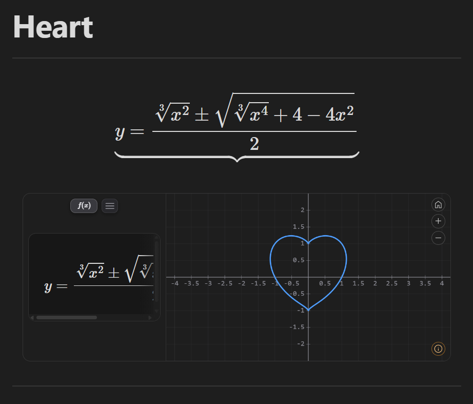
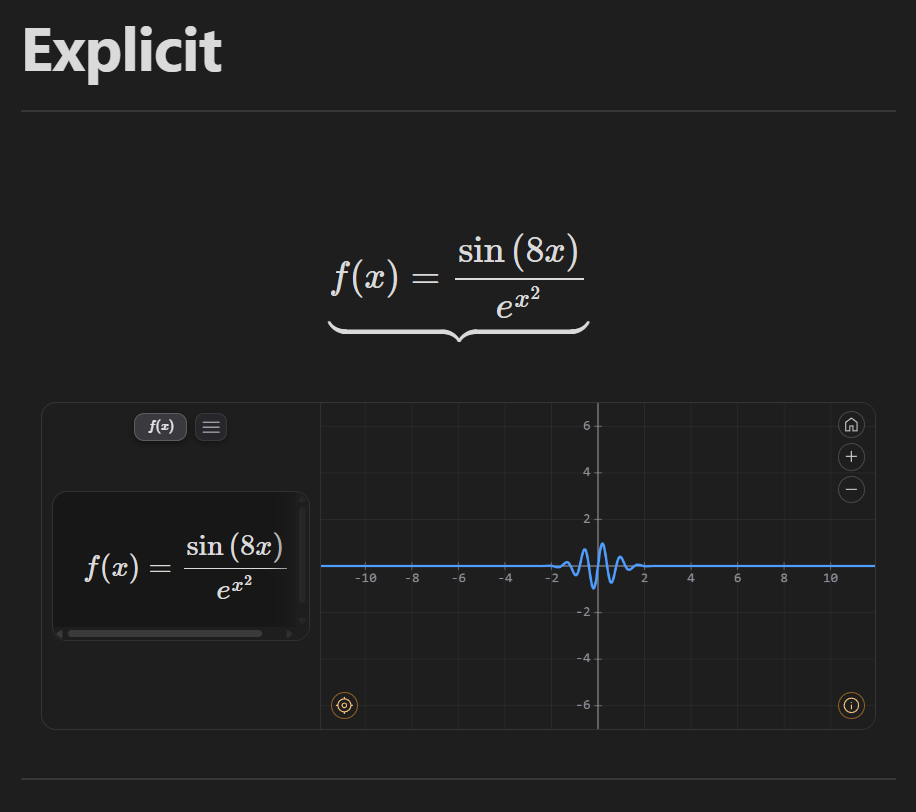
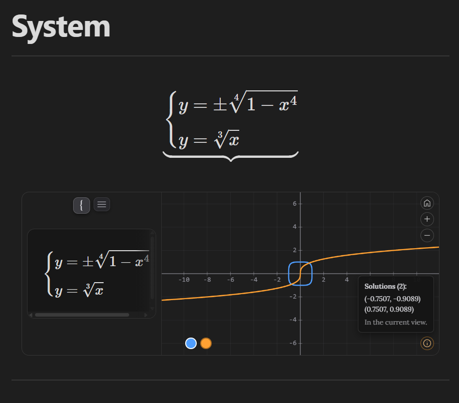
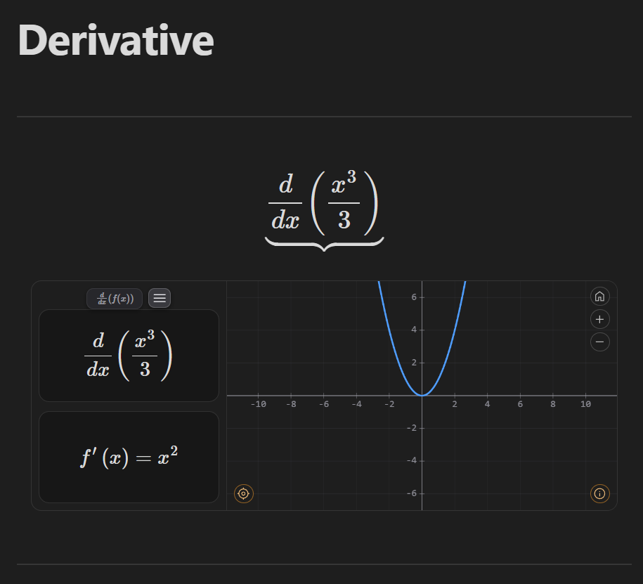
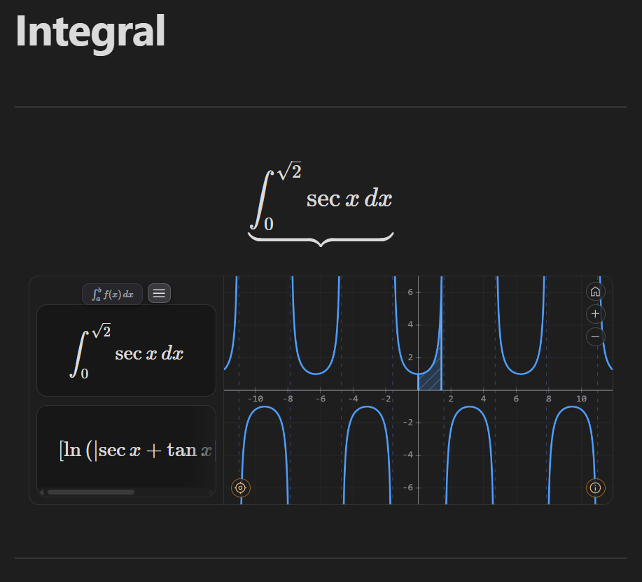
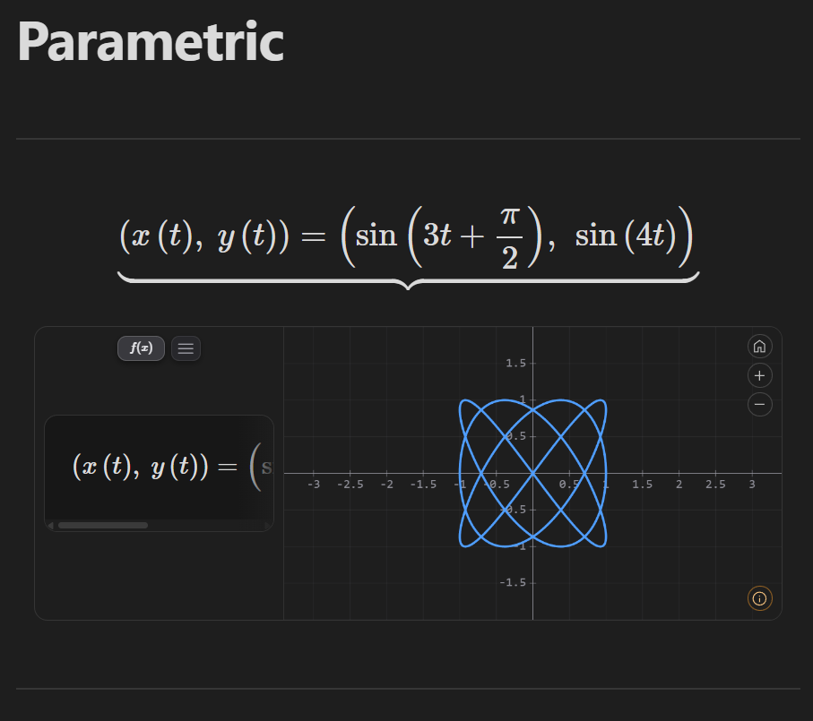
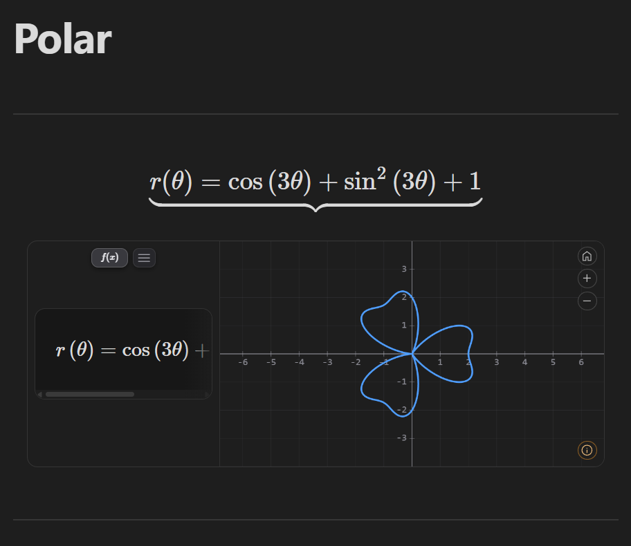

# LMath

LMath is an [Obsidian](https://obsidian.md) plugin for graphing functions, systems of equations, derivatives and integrals directly inside your notes: each graphing block shows the formula rendered in LaTeX (KaTeX) on the left, and an interactive Cartesian plane (pan, zoom, crosshair, rail mode) on the right. The `_trig` block shares that frame but not the plane: it draws the unit circle in a fixed view, with no camera, and puts its controls where the formula would be. The `_vector` block shares the frame too, but shows one card per line instead of one formula per block, and only opens a plane when there is something to draw.

## Why

LMath brings mathematical graphing directly into your Obsidian notes. Write an equation where you are already working and immediately see its graph, derivative, integral, system solution, trigonometric representation, or vectors without leaving the note.

It is designed to keep mathematical exploration and mathematical writing in the same place.

## Contents

- [Available blocks](#available-blocks)
- [Features](#features)
- [Cover](#cover)
- [Gallery](#gallery)
- [Installation](#installation)
- [Usage](#usage)
- [Input syntax](#input-syntax)
- [Settings](#settings)
- [Known limitations](#known-limitations)
- [Contributing](#contributing)
- [Third-party resources](#third-party-resources)
- [License](#license)

---

## Available blocks

| Block | What it graphs |
|---|---|
| ` ```_graph ` | A single function or curve: explicit `y=f(x)`, implicit `F(x,y)=0`, parametric `(x(t), y(t))` or polar `r(θ)`. |
| ` ```_system ` | Several equations (one per line, or LaTeX `\begin{cases}…\end{cases}`), each with its own color, plus the **solutions of the system** (intersections between curves). |
| ` ```_derivate ` | Differentiates `f(x)` symbolically and graphs **only the derivative** `f'(x)`. |
| ` ```_integral ` | Definite integral `\int_a^b f\,dx`: graphs the integrand, **shades the region** between `a` and `b` and shows the signed area (and the antiderivative, when the built-in integrator covers it). |
| ` ```_trig ` | The **unit circle**: you write one or more angles and see where they fall, with their sine, cosine and tangent as segments and their **exact** values (`P(30°) = (√3/2, 1/2)`). |
| ` ```_vector ` | **Vector notation**: one card per line, typeset as what it is — `v = (3,2)` gets the arrow of `\vec{v}`, `A = (1,2)` does not, `F(x,y) = (-y,x)` is a field. Vectors and points with numbers are also drawn on a plane, with an **ⓘ** panel for what follows from them. |

---

## Features

- Custom graphing engine: it discovers and traces the curve by arc length rather than sampling a pixel-bound grid, so bounded curves (heart, astroid, lemniscate) neither deform nor vanish on zoom out.
- Dense implicit curves switch to viewport-aware pixel rasterization with marching squares when needed.
- LaTeX rendering of the entered expression, including nested exponents and roots of any index.
- Interactive zoom and pan with the mouse and the keyboard, a crosshair tracking `x` and `f(x)` in real time, and rail mode (⌖) that walks the curve by on-screen arc length and jumps between branches at asymptotes.
- Automatic detection of roots, vertices and the Y intercept, displayed as markers on the plane; functions with infinitely many notable points (periodic ones) show a summary through the ⓘ button.
- Vertical asymptotes detected and drawn as dotted lines.
- Non-graphable blocks classified with an informative overlay (*Not defined over ℝ*, *Undefined*, *Indeterminate*, *Unsupported symbol*, …).
- Input in LaTeX, Unicode (`π`, `√`, `×`, `÷`, `²`, `³`, `θ`, `∞`) and standard mathematical notation, including absolute value (`|x|`, `abs(x)`), the six inverse trigonometric functions and step functions (`⌊x⌋`, `⌈x⌉`).
- Domain restrictions written next to the formula (`\sin x {0 \leq x \leq 2\pi}`), for explicit, implicit, parametric and polar curves alike.
- Parameters declared above the formula (`A = 1`) and moved with a slider, in a view of the panel that the formula's own bar switches to.
- A unit circle block (`_trig`) with exact values on the 24 notable angles, a draggable point with snapping, and sine, cosine and tangent drawn as the segments they are.
- A vector notation block (`_vector`) where the case of the first letter decides the typography, with `AB` resolving to the vector between two declared points and a plane labelled with the same KaTeX letters as the cards.
- A symbolic math engine (`src/math/`) that answers questions from the equations rather than from the drawing — exact rational arithmetic, Sturm sequences for real roots, polynomial elimination.

---

## Cover

<figure>
	
	<figcaption><strong>Cover.</strong> Heart-shaped implicit curve traced on a Cartesian plane, with the formula rendered in the side panel.</figcaption>
</figure>

---

## Gallery

<figure>
	
	<figcaption><strong>Explicit function.</strong> Rendered in the panel and traced on the plane with axes and interactive markers.</figcaption>
</figure>

<figure>
	
	<figcaption><strong>Systems of equations.</strong> Traced with differently colored curves and intersections computed from the equations.</figcaption>
</figure>

<figure>
	
	<figcaption><strong>Derivatives.</strong> Symbolic derivative shown in a split view, with the operator and the result displayed separately.</figcaption>
</figure>

<figure>
	
	<figcaption><strong>Definite integrals.</strong> Shaded region, evaluated antiderivative when available, signed area in the panel.</figcaption>
</figure>

<figure>
	
	<figcaption><strong>Parametric curves.</strong> Traced from its components, with the corresponding notation in the panel.</figcaption>
</figure>

<figure>
	
	<figcaption><strong>Polar curves.</strong> Traced with the <code>r(θ)</code> notation in the panel and its corresponding geometry on the plane.</figcaption>
</figure>

---

## Installation

### From Obsidian (recommended)

1. Open **Settings → Community plugins** and turn off **Restricted mode** if it is on.
2. Click **Browse**, search for **LMath**, and click **Install**.
3. Click **Enable**.

### Manual

1. Download `main.js`, `manifest.json` and `styles.css` from the [latest release](https://github.com/LubrieDev/lmath/releases).
2. Create the `lmath` folder inside `<your-vault>/.obsidian/plugins/`.
3. Copy the files there.
4. In Obsidian: **Settings → Community plugins** → enable **LMath**.

### From source

```bash
git clone https://github.com/LubrieDev/lmath.git
cd lmath
npm install
npm run build
```

Copy the generated `main.js`, along with `manifest.json` and `styles.css`, to your vault's plugins folder.

---

## Usage

### `_graph`

Write a function; if you write a full equality the plugin automatically takes the right-hand side (`y = …`, or a single-letter function label such as `f(x) = …`).

````markdown
```_graph
f(x) = sin(x) * 2
```
````

Implicit, parametric and polar:

````markdown
```_graph
x^3 + y^3 = 9
```
````

````markdown
```_graph
x(t) = 5*cos(t) - cos(5*t)
y(t) = 5*sin(t) - sin(5*t)
```
````

````markdown
```_graph
r = sin(3*theta)
```
````

### `_system`

One equation per line; each one takes its own color, and the **solutions** (intersections) between them are marked. The **ⓘ** button lists those solutions, and they are computed from the equations, not read off the plotted curves: for a polynomial system they are exact (`(0, 0)`, `(-3/2, 9/4)`) and complete over ℝ, and they do not change when you zoom or pan. Systems that are not polynomial are solved numerically over a fixed interval, which the panel states; a system whose curves overlap along a stretch is reported as having infinitely many solutions rather than being enumerated.

````markdown
```_system
y = x + 1
y = -x^2 + 3
```
````

### `_derivate`

You only write `f(x)`; the block differentiates and graphs `f'(x)`.

````markdown
```_derivate
x^3 - 2*x
```
````

### `_integral`

LaTeX input with the limits of integration.

````markdown
```_integral
\int_{0}^{2} x^2 \, dx
```
````

### `_trig`

The unit circle. An empty block already draws a working figure at 30°, because here the circle **is** the content. One line, one angle; the `=` only puts a name on it.

````markdown
```_trig
α = 30°
β = 150°
γ = 210°
δ = 330°
```
````

You can write the angle any way the rest of the plugin accepts: `30°`, `-45°`, `750°`, `\frac{\pi}{6}`, `pi/6`, `2\pi`. A line that is not a readable angle is reported in the panel instead of being dropped; if none of them is readable, the block falls back to 30° and says so.

**Two rules for degrees vs. radians.** The angle a block *declares* is read in **radians** when it is a bare number — `θ = 30` is 30 radians (it lands at 1718.9°, not at 30°) — and degrees need the `°`. Inside a **trigonometric function**, the plugin keeps its usual convention: a literal argument is read in **degrees**, so `sin(30)` is `0.5` here exactly as in `_graph`. Both rules can meet in one line: `θ = sin(30)` is 0.5 radians, because `sin(30)` is the sine of 30 degrees.

Drag the point — the grabbable part is the rim of the circle, not the middle — or use the slider, the arrow keys (the plane has to be focused) or the ▶ button. Dragging snaps to the notable angles by default; hold **`Alt`** to place the point anywhere without going to the settings to turn snapping off.

**Naming a ratio turns its trace on.** If the expression is exactly a call to `sin`, `cos` or `tan` on a constant angle, the block opens with that component already drawn:

````markdown
```_trig
sin(30)
```
````

It chooses a trace, it does not change the angle: `sin(30)` still evaluates to `0.5`, so the block draws 0.5 radians with the sine lit. The call has to be the whole expression — `2sin(30)` and `sin(30)+cos(30)` light nothing — and `asin`, `sinh`, `cot` and `sec` do not count, because they have no trace on the figure. It is only the starting state: once you touch a toggle, the selection is yours.

On a notable angle — any multiple of 15° — the coordinates and the ratios are given in **exact** form rather than as decimals, but only if the angle earned it: either the block wrote it in degrees or in terms of π, or you reached it with the block's own controls. A decimal typed by hand stays a decimal, so `θ = 0.5236` never claims to be π/6.

**On a narrow block it has two faces**: the `f(x)` button in the bottom-left corner swaps the circle for the formula panel, which takes exactly the space the circle occupied. What does **not** swap is the strip at the foot: the sine/cosine/tangent boxes, the θ reading and the slider are the block's controls and stay usable. Only the **ⓘ** steps aside while the formula is showing, and it returns with the circle.

### `_vector`

Vector notation, written the way you would write it on paper. **One line, one card.** The block has no syntax of options: what a line means comes from the shape it has, and nothing you write is resolved for you — `w = u + v` is typeset, not computed.

The case of the first letter is the whole rule:

````markdown
```_vector
v = (3,2)
A = (1,2)
F(x,y) = (-y, x)
```
````

- **lowercase → a vector.** It is typeset `\vec{v}` and drawn as an arrow from the origin. A name of two or more letters takes `\overrightarrow` instead.
- **UPPERCASE → a point.** It is typeset bare, `A`, and drawn as a dot — deliberately *not* an arrow from the origin: a point is not a position vector unless you say so.
- **a name with arguments → a vector field.** `F(x,y) = (-y, x)` is typeset as the function call it is and is **not drawn**: it is not one vector, it is infinitely many. The genre earns the card its typography and nothing else.

If you prefer to write the arrow yourself, `\vec{v} = (3,2)` works and is not doubled up — and an explicit arrow wins over the case rule, so `\vec{A} = (1,2)` really is a vector.

**The vector between two points.** Write `AB` on its own line and it resolves to the vector from `A` to `B`, provided both are declared in the same block. `A->B`, `A → B`, `\vec{AB}` and `\overrightarrow{AB}` all mean the same thing on input; what the card shows is `\overrightarrow{AB}`:

````markdown
```_vector
A = (1,2)
B = (5,4)
AB
```
````

If the two points are not declared, `AB` is just the product `A·B` and is typeset as such: the block never invents coordinates you did not write.

**The plane is always there, and says when it is empty.** The view is computed once from the vectors and has no camera: there is no panning, zooming or dragging, because a finite set of arrows is fully known in advance. When no line has numeric components, the plane is dimmed with a reason instead of sitting empty: *No vector* on an empty block, *Nothing to draw* when what you wrote is not an arrow (a field, a gradient, an unresolved `w = u + v`). Those lines are still typeset in their cards.

**ⓘ — what follows from what you wrote.** When there is a plane there is also an ⓘ button on it, and it reports what can be *deduced* from the arrows and dots already drawn.

- **One collapsible section per vector**, headed by its name: its `x` and `y`, its magnitude, its direction, the quadrant or semiaxis it falls in, and its unit vector. For `AB` the components are the difference `B − A`.
- **With exactly two vectors**, one more section: dot product, angle between them, determinant, the area of the parallelogram they span and that of the triangle — and, when it holds, *Perpendicular* or *Parallel*. With exactly two points: distance and midpoint.
- **Two and only two.** Five vectors make ten pairs; the block will not pick one of them for you.
- Values are **exact when they were earned** — with integer components the magnitude of `(3,2)` is given as `√13 ≈ 3.606`, and `(0.5, 1.3)` gets the decimal alone. Angles follow the **Angle unit** of [Settings](#settings), the same one `_trig` uses.

### Restricting the domain

Write the interval in **braces at the end** of the expression, and the curve is drawn only there:

````markdown
```_graph
f(x) = \sin x {0 \leq x \leq 2\pi}
```
````

`\leq`, `\le`, `<=` and `≤` all work. `<` draws exactly what `≤` draws, because the difference is one point and a point is not a pixel.

| you write | you get |
|---|---|
| `\sin x {0 \leq x \leq 2\pi}` | one period, nothing outside it |
| `\sqrt{x} {x \geq 4}` | bounded on one side; the other end stays where it was |
| `x^2+y^2=9 {0 \leq y \leq 3}` | the upper half of the circle — an implicit curve takes `x` **or** `y` |
| `(\cos t, \sin t) {0 \leq t \leq \pi}` | half a circle: here the interval *is* the parameter's range |

An end can be **anything that is a number**: `2\pi`, `\frac{\pi}{2}`, `e`, or `\infty` when you only want to bound one side. The panel shows the interval as a clause after the formula — `f(x) = \sin x,  0 ≤ x ≤ 2π` — with the ends **as you wrote them** (`2π`, not `6.283185…`).

The restriction has to name the **block's own variable** (`\sin x {0 \leq t \leq 3}` is reported as *Restriction on another variable*). An interval it cannot read at all is reported as *Unreadable domain restriction*, quoting what you wrote. It works in `_graph` and `_system`, one interval per equation; `_derivate` and `_integral` do not take it yet.

### Parameters with sliders

Declare a value on its own line and use its name in the formula. A **sliders button** joins the bar above the formula panel; it switches the panel to one slider per parameter, and moving one redraws the curve without moving your view:

````markdown
```_graph
A = 1
\alpha = 1
\phi = 0
B = 2
f(x) = A\sin (\alpha x + \phi) + B
```
````

A line is a declaration when it is **a name, an `=`, and a constant** — `A = 1`, `\alpha = 2\pi`, `k = \frac{1}{2}`. Anything else stays what it always was: `y = 2` is still the horizontal line, and `x`, `y`, `r`, `t` and `\theta` cannot be parameters because the plane is drawn in them. A parameter cannot be defined from another (`B = 2A` is not read as a declaration), and a name **shadows a constant of the same name**: after `\phi = 0` that block's `\phi` is your phase, not the golden ratio — the rule reaches `e` too, so `e^x` in a block that declares `e` is no longer the exponential.

Sliders run from **−10 to 10** by default, in steps of 0.01, and stretch if the value you declared falls outside. The formula panel keeps the **names** (`A sin(αx + φ) + B`) while the plane draws the numbers.

### Interacting with the graph

The four graphing blocks share the same plane. `_trig` has a fixed view and none of these: dragging moves the angle instead of the view, and there is no zoom, no pan and no crosshair. The plane of `_vector` has none of these either: its view is computed once from the vectors and does not move. Its only buttons are the **ⓘ** panel and, on a narrow block, the `f(x)` that brings the cards over the plane.

| Action | Effect |
|---|---|
| Move the cursor | Shows a crosshair with `x` and `f(x)` in real time |
| Bring the cursor near a notable point | Shows a coordinate label `(x, y)` |
| Drag | Moves the view (pan) |
| Mouse wheel | Zoom in/out anchored at the cursor (the point under it stays put) |
| ± buttons | Zoom in/out anchored at the center of the view, so the point under the cursor does change |
| ⌖ button (rail mode, when the curve is walkable) | Walk along the curve with the keyboard, jumping between branches at asymptotes |
| In `_system`, the color button per equation | Choose which curve the crosshair/rail follows |

On an explicit curve (`y = f(x)`) the `f(x)` the crosshair reports is **evaluated from the function**, so it is the same value at any zoom and any pan. On implicit, parametric and polar curves it is still read off the traced polyline, and there the last digits do move with the view. Since 2.0.0 those readings are at least **marked** as interpolated, so they no longer claim more precision than they have — but the number itself still moves with the view.

Since 2.0.0 the readout also **shows what it knows**: an evaluated reading gets six significant figures with its trailing zeros kept, so two nearby heights stay apart and the decimal count does not jump from pixel to pixel. A reading that was interpolated keeps the shorter format, because its last digits are noise from the tracing rather than information. The **ⓘ** panels follow the same idea: `f(0)`, the slope at the origin and the limits you wrote on an integral are *calculated* and get six figures, while roots, vertices and areas are *estimated* by numeric methods and keep four — showing more of those would be showing noise.

### Functions with many notable points

In periodic functions such as `sin(x)` or `tan(x)`, the roots and vertices are infinite and are not drawn individually. Instead, an **ⓘ** button appears in the corner of the graph and shows a summary when clicked.

### Non-graphable functions

If the function does not produce any real value (for example `sqrt(-1)` or `log(x)/log(1)`), the plane is dimmed with a label indicating the cause: *Not defined over ℝ*, *Undefined*, *Indeterminate*, among others. Zoom and pan remain active. An empty block shows the message *No function* instead of an error. `_trig` is the exception: an empty block there is a complete figure at 30°. `_vector` follows the same rule with its own words (*No vector*, *Nothing to draw*).

---

## Input syntax

The plugin normalizes different formats before evaluating them with [mathjs](https://mathjs.org/). This applies to all six blocks, which share the same parser — `_trig` and `_vector` included: the first reads the angle you write with exactly this machinery, and the second reads each component of a pair with it.

| Type | Examples |
|---|---|
| Unicode | `π`, `√`, `∛`, `∜`, `×`, `÷`, `²`, `³`, `θ`, `∞`, `⌊x⌋`, `⌈x⌉` |
| LaTeX | `\frac{1}{2}`, `x^{2}`, `\sqrt{x}`, `\sqrt[3]{x}`, `\sin{x}`, `\log_{2}{x}`, `\left(x\right)`, `\int_{0}^{1} x^{2} \,dx` |
| Standard | `sin(x)`, `cos(x)`, `log(x, 2)`, `sqrt(x)`, `abs(x)` |
| Inverse | `arcsin(x)`, `sin⁻¹(x)`, `asin(x)` (and their analogues for cos, tan, csc, sec, cot) |

> ⚠️ **Trigonometry (degrees vs. radians):** if the argument is a literal number (e.g. `sin(30)`), it is interpreted in **degrees**; if the argument contains a variable (e.g. `sin(x)`), it is evaluated in **radians**. This is about the **argument of a function**. The angle that an `_trig` block declares follows the opposite rule: a bare number there is **radians** (`θ = 30` is 30 radians), and degrees need the `°`.

> ⚠️ **Logarithms (default base):** `log(x)` written without a base means **base 10**, as it does on a calculator — `log(100)` is `2`. For the natural logarithm write `ln(x)` or `\ln x`. An explicit base is always respected: `log(x, 2)`, `\log_{2}{x}` and `log2(x)` all mean base 2.

**Roots of any index:** the `\sqrt[n]{x}` notation is supported for cube, fourth, fifth roots, and so on. Odd-index roots with a negative radicand return the real value (e.g. `\sqrt[3]{-8} = -2`).

**Absolute value:** `|x|`, `\left|x\right|` and `abs(x)` are all accepted.

**Inverse trigonometric functions:** `arccsc`, `arcsec` and `arccot` are not native to mathjs; the plugin implements them as real-domain wrappers.

**Component-wise parametric curves:** `x(t)=…` and `y(t)=…` on separate lines are merged into a single curve; a lone component also graphs, respecting the axis it declares.

**Unrecognized symbol:** an unknown LaTeX command (`\alpha`, `\sum`, …) does not silently degrade into a free variable: the block shows **"Unsupported symbol"**.

**Complex numbers:** not supported. If the function produces an imaginary result, the plane will show the non-graphable function overlay.

---

## Settings

The plugin adds a settings tab (**Settings → LMath**). **Every setting here applies immediately**: the blocks already on screen rebuild themselves, which also returns their zoom, their view and the angle of a `_trig` to the starting point.

- **Language** — language selector for the interface text (English / Spanish / Portuguese / German; English by default).
- **Solve automatically** — when rendering, it directly shows the solved result (`y = f(x)`) without pressing the "Solve" button.
- **Show notable points** — draws the markers for roots, vertices, Y intercepts and system solutions on the plane. Turning it off leaves the plane clean; the ⓘ summary still lists them, and the crosshair and rail mode are unaffected.
- **Automatic framing** — zooms the initial view in when the curve is bounded and leaves a lot of empty plane (heart, lemniscate, astroid…); it only zooms in, never out.

Under **Trigonometric circle**, for `_trig`:

- **Angle unit** — degrees, radians or gradians (degrees by default). Presentation only: it changes how angles are *written*, never how a block is read, so a bare number is still radians whatever you pick. Each `_trig` block also has a **θᴅ / θʀ / θɢ** chip that overrides it for that block until the note is re-rendered. It is also the unit of the angles in the ⓘ panel of `_vector`, which has no chip of its own.
- **Snap to notable angles** — whether dragging the point snaps to the multiples of 15° (on by default). Hold **`Alt`** while dragging to suspend it for that gesture, without coming back here to turn it off. There is no chip for this one; it is set here or not at all.

No setting here ever writes to your notes.

---

## Known limitations

> **This plugin has bugs.** Much of what works today was fixed *after* watching it fail in a real block, and the list below is what is already known — not a claim that the rest is sound. The block host has no automated tests at all, so everything you can see (panels, buttons, the camera, every pixel of a curve) is checked by hand. If you hit something, an issue with the exact block that reproduces it is worth more than a description.

- `_system` requires two or more equations; for a standalone curve (including an implicit one), use `_graph`.
- Regions and inequalities are not graphed. The LaTeX inequality operators (`\ge`, `\le`, `\geq`, `\leq`) are accepted **only inside a domain restriction** (`{0 \leq x \leq 2\pi}`); written on their own, `y \le x` is still reported as an *Unsupported symbol*.
- A domain restriction bounds one variable of its own block, and `_derivate` and `_integral` do not accept one at all. In a restricted block the ⓘ summary is not offered either: it reasons over the whole function, so it would list roots that are not drawn. One interval per equation: `{0 ≤ x ≤ 2 and 0 ≤ y ≤ 2}` is not a syntax, and an implicit curve can be bounded on `x` **or** on `y`, not on both. `<` and `≤` draw the same — there is no hollow circle at an open end — and a clipped curve is cut square, with nothing marking the boundary.
- Parameters (`A = 1`) work in `_graph` and `_system` only. A parameter cannot be defined from another, there is no syntax for the slider's range (−10 to 10, stretched to fit the value you wrote), nothing animates a parameter, and a parameterised block shows the geometric ⓘ instead of the analytic one.
- Dragging a slider retraces the curve, so on a view that is already slow to pan (a dense `tan(x²)` zoomed far out) the drag will be just as slow. The drag runs at the interactive quality and refines when you let go; there is no automatic drop in quality beyond that.
- The symbolic integrator has textbook-level scope: when it cannot find an antiderivative, the panel falls back to the numeric value. Improper integrals (limits at `±∞`) are labeled, not evaluated.
- The crosshair and rail mode follow a single curve at a time and require it to be walkable as `y=f(x)`.
- The visual behavior of functions with dense asymptotes (such as `sec(10x)`) at extreme zoom-out is inherent to the periodic nature of those functions.
- In `_trig`, exact values exist only for the multiples of 15°, and only for angles that earned the right to them (written in degrees or in terms of π, or reached with the block's own controls). Everything else is shown as a decimal.
- `_trig` shows the angle you are *looking at*, not the one the note declares: dragging, animating and switching units never rewrite the block, and re-rendering the note goes back to what is written.
- The ⓘ panel of `_trig` does not follow the unit chip: it lists degrees and radians as separate rows, and every other angle in it is given in degrees. The rim labels only follow the chip when the plane is too small for two lines; with room for two they always show degrees over the fraction of π, whatever the chip says.
- Holding `Alt` frees the drag from the magnet, but nothing in the block's own interface hints at it: inside the app the modifier is only described in the settings tab.
- `_vector` writes, draws and reports; it does not operate. `w = u + v` is typeset and left as it is, and nothing in the block — the ⓘ panel included — produces a vector you did not write. There are no arrows for a field `F(x,y)`, and the plane has no camera: no panning, no zooming, no dragging the tip.
- The ⓘ panel of `_vector` relates **exactly two** vectors, or exactly two points. With three or more it lists each one on its own and says nothing about the pairs, because the block cannot know which pair you mean.
- Exact values in that panel require **integer components**: `(3,2)` gives `√13`, while `(0.5, 1.3)` gives the decimal alone, even where a closed form exists.
- `_vector` is two-dimensional and Cartesian: a line with three components (`(1,2,3)`) is not a pair, so it is typeset as free notation rather than drawn.
- The card layout of `_vector` grows up to four lines; from the fifth on, the cards share the panel height instead of making the block taller, so long blocks get small cards (each keeps its own scrollbar). The two-view toggle only splits the load when the block mixes declarations with an `AB`; four declared vectors still share one column.
- **The implicit product can still become visible in an unclassified line.** Only a line carrying a symbol LMath does not support is passed through untouched; anything else is normalized first, and a name followed by `(` gains a `∗`. It shows in a function call whose right-hand side is not a pair: `G(x,y) = -y` comes out as `G∗(x,y) = −y`.
- **The solutions of a system used to be read off the drawing, and that was a bad design decision.** They were the crossings of the traced polylines, clipped to the visible view, so the value depended on where the polyline's vertices happened to fall — an intersection at the origin read `(8.4e-6, 8.4e-6)` after panning — and a solution outside the view did not exist at all. It is fixed: they now come from the equations. What remains is the boundary, and it is real:
  - A system that is **not polynomial** is solved numerically over `−100 ≤ x ≤ 100`, stated in the panel. Complete inside that interval; nothing is claimed outside it.
  - A system pairing a **non-polynomial implicit curve** with anything (`x^2+y^2=9` against `y = \sin x`) is reported as not solvable rather than answered.
  - Above degree 8 the exact path steps aside to keep the panel from stalling, and the numeric one takes over.
  - With three or more equations, what is listed are the crossings **between pairs** of curves, not the points common to all of them.
  - The **markers on the plane** still come from the traced geometry. The difference from the listed value is millionths of a pixel, so it is invisible, but it is there.
- **The same mistake was in the crosshair, and only half of it is fixed.** On explicit curves the `f(x)` is now evaluated from the function. On implicit, parametric and polar curves it is still interpolated, and `y = ±√(…)` is excluded too, since two branches have no single `y` per `x`. Since 2.0.0 those readings are at least **marked** as interpolated, so they no longer claim more precision than they have — but the number itself still moves with the view.
- **Writing the same power three ways draws three different curves.** `x^{2/3}` gives the full cusp, `x^(2/3)` only its right half, and `x^\frac{2}{3}` is `x²/3` — a different function altogether. The rule that reads a fractional exponent as a real cube root only fires when the exponent is written in **braces**. Known, measured, and not fixed in this release: the fix changes what already-written notes draw.
- **`\sin^{-1}x` without parentheses draws nothing.** It is read as the symbol `asin` multiplied by `x`, which is undefined everywhere. Write `\sin^{-1}(x)` or `\arcsin x`.

---

## Contributing

Bug reports, feature requests and pull requests are welcome — see [CONTRIBUTING.md](https://github.com/LubrieDev/lmath/blob/main/CONTRIBUTING.md) for how to build, test and send changes, and the [Technical Reference](https://github.com/LubrieDev/lmath/blob/main/docs/TECHNICAL-REFERENCE.md) for the engine internals.

---

## Third-party resources

LMath includes a small number of third-party assets distributed under their respective licenses.

| Asset | Author | License | Purpose |
|-------|--------|---------|---------|
| Material Symbols | Google LLC | Apache License 2.0 | User interface icons |
| Lora | The Lora Project Authors | SIL Open Font License 1.1 | User interface font |

### Material Symbols

Material Symbols is © Google LLC and is licensed under the Apache License, Version 2.0.

- https://fonts.google.com/icons
- https://www.apache.org/licenses/LICENSE-2.0

No modifications were made to the icon glyphs themselves; a subset is bundled with the plugin for offline use.

### Lora

Lora is © The Lora Project Authors and is licensed under the SIL Open Font License, Version 1.1.

- https://fonts.google.com/specimen/Lora
- https://openfontlicense.org

Lora is used for the interface text and also as the source of three glyph outlines: the `D`, `R` and `G` in the **θᴅ / θʀ / θɢ** chip of `_trig` are the letters of Lora Italic, taken from the font and converted to path data rather than redrawn, so the chip uses the same letterforms as the rest of the interface. The θ itself is drawn by hand, since Lora carries no Greek. Both live in `assets/icons/custom/` next to the code that draws them.

---

## License

MIT — see [LICENSE](https://github.com/LubrieDev/lmath/blob/main/LICENSE).
